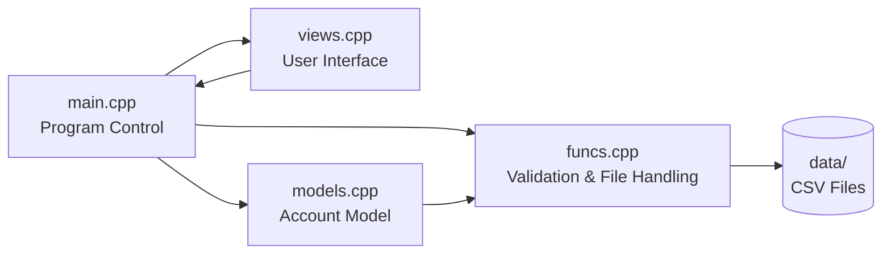

# Bank System Simulator (C++)

[](https://github.com/iman608/bank-system-simulator/actions/workflows/build.yml)

A university project that simulates a simple console-based banking system written in C++.  
The program uses file-based I/O (CSV files) to store and manage account information and transaction history.

---

## Features

- Sign Up and Log In system
- Account number & password validation
- Profile management (view & update personal information)
- Balance management
  - View balance
  - Increase balance
- Money transfer between accounts
- Transaction history saved per user
- Automatic CSV file creation if files do not exist

---

## Project Structure

```
bank-simulator/
│
├── src/
│   ├── main.cpp
│   ├── funcs.cpp
│   ├── models.cpp
│   ├── views.cpp
│
├── include/
│   ├── funcs.h
│   ├── models.h
│   ├── views.h
│
├── data/
│   ├── Accounts.csv
│   ├── <UserID>.csv
│
├── Makefile
├── README.md
└── .gitignore
```

### Folder Description

- `src/` → Implementation files  
- `include/` → Header files  
- `data/` → All CSV files  
- `Accounts.csv` → Stores account number, password, and user ID  
- `<UserID>.csv` → Stores user profile and transaction history  

---

## Build Instructions

### Linux / macOS

From the root project directory:

```bash
make
./bank
```

---

### Windows (MinGW)

```powershell
mingw32-make
.\bank.exe
```

---

## Manual Compilation (Without Makefile)

```bash
g++ -std=c++17 -Iinclude src/main.cpp src/funcs.cpp src/models.cpp src/views.cpp -o bank
./bank
```

---

## Architecture Overview



---

## Important Notes

- The program must be executed from the project root directory.
- All CSV files are stored inside the `data/` folder.
- If required files do not exist, the program creates them automatically.
- This project is designed for educational purposes.

---

## Technologies Used

- C++17
- g++
- Makefile
- File I/O (CSV handling)

---

## License

MIT License
